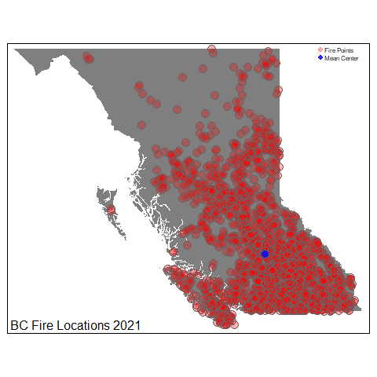
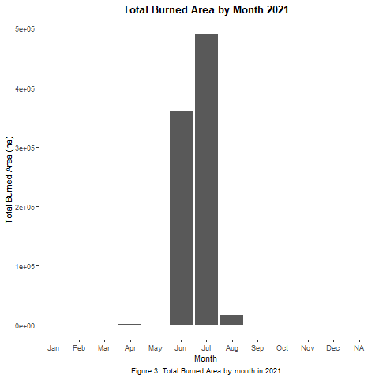
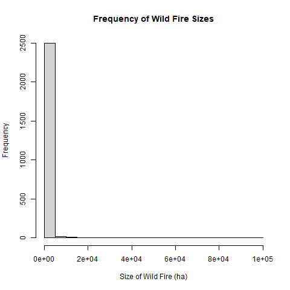
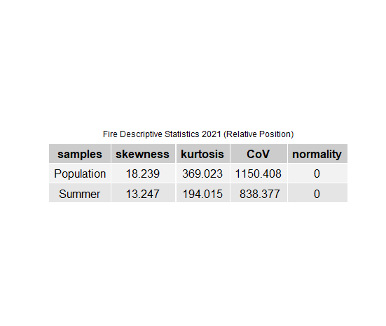
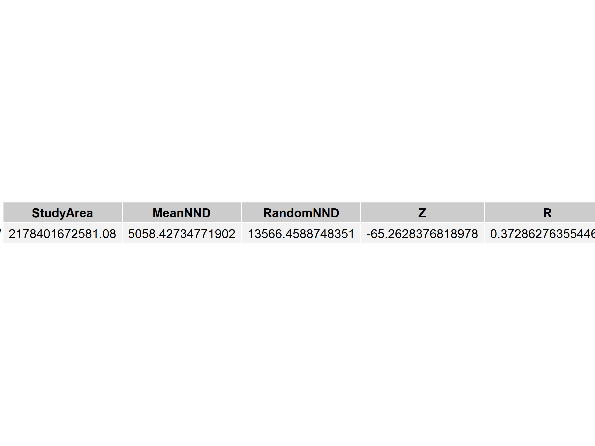
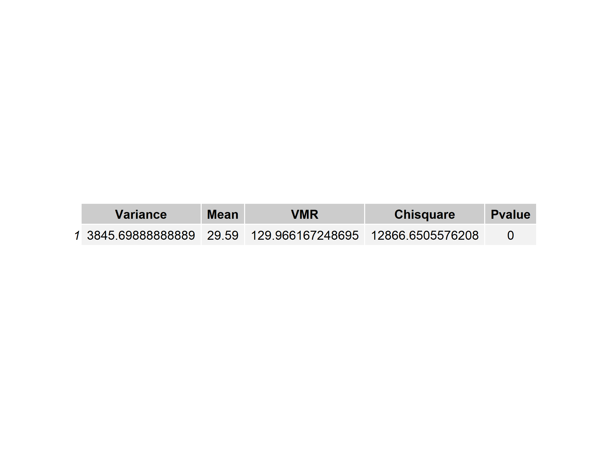
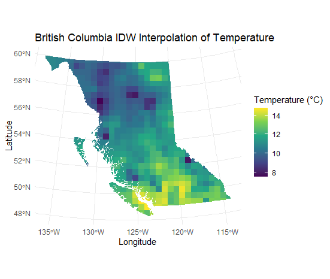
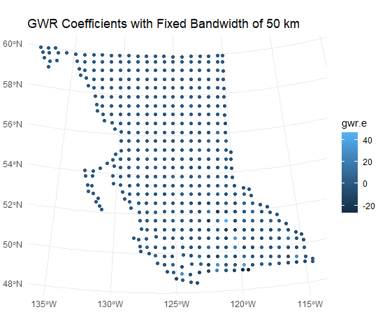

### Exploring Associations between British Columbia's Climate and Fire Events in 2021: Point Pattern Analysis, Interpolation, and Regression
#### Michaela Meil: Advanced Spatial Analysis Final Project
#### December 2024

## Context

Wildfire has been the primary natural disturbance in the majority of British Columbia’s forests, and is predicted to be an increasing disturbance due to climate change (Zu, 2014). Four of the most severe wildfire seasons of the century have occurred in the past seven years: 2017, 2018, 2021, 2023 (Parisien et al., 2023). Factors such as temperature, precipitation, vegetation (mountain pine beetle outbreaks), timber harvest, soil condition, outdoor activities, and lack of traditional management practices all have significant impacts on wildfire (Stahl et al. 2006). While wildfires have significant effects on the landscape ecology, people living within British Columbia’s borders suffer from adverse health impacts from smoke, anxiety, and loss of neighborhood unity (Butry et al. 2001; Kochi et al. 2010).

## Identifying the Problem
The vast amount of factors influencing wildfires makes it challenging to understand why wildfires occur (Zu, 2014). Temperature has been used as an effective and significant factor in future wildfire occurrence modelling, with higher accuracy than precipitation (Zu, 2014).  In this statistical analysis, we take temperature data across the province of British Columbia, along with fire data for the year 2021 to ask: Can temperature explain wildfire occurence in British Columbia? Are these events clustered or dispersed?

## Study Site

British Columbia has 60 million hectares of forests and other natural vegetation types (i.e., grasslands, shrublands, and woodlands), and 76% of land is forested are characteristics that have shaped the area’s social, cultural, and economic identity (Parisien et al., 2023). BC’s forests have a full range of moisture, from temperate rainforests to high-desert woodlands; approx. 15% are considered dry, 31% wet, and 54% mesic (Parisien et al., 2023). There is also a small percentage of grasslands  (1%) and shrublands (7.2–12.5%). 
Since the 1950s, the number and area burned of wildfires had been steadily decreasing in the province until approximately 2000, due to a cooler and wetter climatic pattern mid-century. This makes the recent increase of wildfire activity surprising and concerning as the world witnessed some of the worst wildfire seasons to date in the last 7 years. Specifically in 2021, The warmest temperature ever recorded north of the 45th parallel (49.6 °C) occurred in the small town of Lytton, BC, on June 29, 2021 (Parisien et al., 2023). The following day a fire destroyed most of the community in minutes. The link between temperature and wildfire is evident here, along with the stark impacts it has on rural communities. 
 
### Descriptive Statistics	
 In our study, we take temperature data from 615 weather stations from the Pacific Climate Impacts Consortium BC Station Data, and 2,959 fire events from the BC Data Catalogue Wildfire Incident Locations - Historical Dataset. Average temperature ranges are between 0 and 20 degrees C (Figure 1). The mean centre was congregated in the mid-south/east section of British Columbia, which coincides with the Interior zone, which is home to numerous sensitive, alpine, and desert ecosystems that are extremely susceptible to wildfire (Figure 2), and most of the fires burned between Juny and July 2021 (Figure 3). There were many small-sized fires (ha) that burned in 2021, but few large-sized fires (ha) (Figure 4).


Figure 1: *Map of Climate Data Points in British Columbia, Data Retrieved from PCDS* 


Figure 2: *Map of BC Fire Locations in 2021 with the mean centre.*

Figure 3: *Bar Graph of Total Burned Area by Month in British Columbia, 2021.*

Figure 4: *Histogram of Frequency of Wildfire Sizes in British Columbia, 2021.*

Figure 5: *Table of Central Tendencies Fire Descriptive Statistics for British Columbia in 2021*

Figure 6: *Table of Relative Position Fire Descriptive Statistics for British Columbia in 2021*

You can see how the Descriptive Statistics for Wildfire in 2021 were calculated here:
```r
install.packages("terra")
install.packages("lubridate")
install.packages("e1071")
install.packages("gridExtra")
install.packages("gtable")
install.packages("grid")
install.packages("ggplot2")
install.packages("dplyr")
install.packages("bcmaps")
install.packages("tmap")
install.packages("sf")

library("terra")
library("lubridate")
library("e1071")
library("gtable")
library("grid")
library("gridExtra")
library("ggplot2")
library("dplyr")
library("bcmaps")
library("raster")
library("maps")
library("tmap")

dir <- "C:/Users/micha/Documents/GEOG 418/Final Project"
setwd(dir)
getwd()

# Load shapefile
shp <- vect("./H_FIRE_PNT_point.shp")
df <- as.data.frame(shp)

# Filter for 2021 data
df <- subset(df, df$FIRE_YEAR == 2021)

# Inspect the format of the IGN_DATE column
head(df$IGN_DATE)
str(df$IGN_DATE)

# Extract the date part (YYYYMMDD)
df$IGN_DT <- as.Date(substr(df$IGN_DATE, 1, 8), format = "%Y%m%d")

# Check if the conversion worked
head(df$IGN_DT)
range(df$IGN_DT, na.rm = TRUE)
# Extract day of the year
df$IGN_Day <- yday(df$IGN_DT)

# Extract month as a labeled factor
df$IGN_Month <- month(df$IGN_DT, label = TRUE, abbr = TRUE)

# Check results
head(df[, c("IGN_DATE", "IGN_DT", "IGN_Day", "IGN_Month")])


# Create subsets for annual and summer (June 1 to August 31)
df_year <- df
df_Summer <- subset(df, IGN_Day >= 152 & IGN_Day <= 243)  # Adjusted day range
# Filter summer data (June 1 - August 31)
print(nrow(df_Summer))
head(df_Summer)

# Calculate descriptive statistics
meanPop <- mean(df_year$SIZE_HA, na.rm = TRUE)
meanSummer <- mean(df_Summer$SIZE_HA, na.rm = TRUE)
sdPop <- sd(df_year$SIZE_HA, na.rm = TRUE)
sdSummer <- sd(df_Summer$SIZE_HA, na.rm = TRUE)
modePop <- as.numeric(names(sort(table(df_year$SIZE_HA), decreasing = TRUE))[1])
modeSummer <- as.numeric(names(sort(table(df_Summer$SIZE_HA), decreasing = TRUE))[1])
medPop <- median(df_year$SIZE_HA, na.rm = TRUE)
medSummer <- median(df_Summer$SIZE_HA, na.rm = TRUE)
skewPop <- skewness(df_year$SIZE_HA, na.rm = TRUE)
skewSummer <- skewness(df_Summer$SIZE_HA, na.rm = TRUE)
kurtPop <- kurtosis(df_year$SIZE_HA, na.rm = TRUE)
kurtSummer <- kurtosis(df_Summer$SIZE_HA, na.rm = TRUE)
CoVPop <- (sdPop / meanPop) * 100
CoVSummer <- (sdSummer / meanSummer) * 100
normPop_PVAL <- shapiro.test(df_year$SIZE_HA)$p.value
normSummer_PVAL <- shapiro.test(df_Summer$SIZE_HA)$p.value

samples = c("Population", "Summer") #Create an object for the labels

means = c(meanPop, meanSummer) #Create an object for the means
sd = c(sdPop, sdSummer) #Create an object for the standard deviations
median = c(medPop, medSummer) #Create an object for the medians
mode <- c(modePop, modeSummer) #Create an object for the modes
skewness <- c(skewPop, skewSummer) #Create an object for the skewness
kurtosis <- c(kurtPop, kurtSummer) #Create an object for the kurtosis
CoV <- c(CoVPop, CoVSummer) #Create an object for the CoV
normality <- c(normPop_PVAL, normSummer_PVAL) #Create an object for the normality PVALUE

means <- round(means, 3)
sd <- round(sd, 3)
median <- round(median, 3)
mode <- round(mode,3)
skewness <- round(skewness,3)
kurtosis <- round(kurtosis,3)
CoV <- round(CoV, 3)
normality <- round(normality, 5)

data.for.table1 = data.frame(samples, means, sd, median, mode)
data.for.table2 = data.frame(samples, skewness, kurtosis, CoV, normality)
outCSV <- data.frame(samples, means, sd, median, mode, skewness, kurtosis, CoV, normality)
write.csv(outCSV, "./FireDescriptiveStats_2021.csv", row.names = FALSE)

table1 <- tableGrob(data.for.table1, rows = c("","")) #make a table "Graphical Object" (GrOb) 
t1Caption <- textGrob("Fire Descriptive Statistics 2021 (Central Tendencies)", gp = gpar(fontsize = 09))
padding <- unit(5, "mm")

table1 <- gtable_add_rows(table1, 
                          heights = grobHeight(t1Caption) + padding, 
                          pos = 0)

table1 <- gtable_add_grob(table1,
                          t1Caption, t = 1, l = 2, r = ncol(data.for.table1) + 1)

table2 <- tableGrob(data.for.table2, rows = c("",""))
t2Caption <- textGrob("Fire Descriptive Statistics 2021 (Relative Position)", gp = gpar(fontsize = 09))
padding <- unit(5, "mm")

table2 <- gtable_add_rows(table2, 
                          heights = grobHeight(t2Caption) + padding, 
                          pos = 0)

table2 <- gtable_add_grob(table2,
                          t2Caption, t = 1, l = 2, r = ncol(data.for.table2) + 1)

grid.arrange(table1, newpage = TRUE)
grid.arrange(table2, newpage = TRUE)

png("Output_Table1.png")
grid.arrange(table1, newpage = TRUE)
dev.off() 

png("Output_Table2.png") 
grid.arrange(table2, newpage = TRUE)
dev.off()

png("Output_Histogram.png")
hist(df_year$SIZE_HA, breaks = 30, main = "Frequency of Wild Fire Sizes", xlab = "Size of Wild Fire (ha)", caption = "Figure 1: Wild Fire Size by month in 2021") #Base R style
dev.off()

barGraph <- df_year %>% #store graph in bar graph variable and pass data frame as first argument in next line
  group_by(IGN_Month) %>% #use data frame and group by month and pass to first argument in next line
  summarise(sumSize = sum(SIZE_HA, na.rm = TRUE)) %>% #sum up the total fire size for each month and pass to GGplot
  ggplot(aes(x = IGN_Month, y = sumSize)) + #make new GGPLOT with summary as data and month and total fire size as x and y
  geom_bar(stat = "identity") + #make bar chart with the Y values from the data (identity)
  labs(title = "Total Burned Area by Month 2021", x = "Month", y = "Total Burned Area (ha)", caption = "Figure 3: Total Burned Area by month in 2021") + #label plot, x axis, y axis
  theme_classic() + #set the theme to classic (removes background and borders etc.)
  theme(plot.title = element_text(face = "bold", hjust = 0.5), plot.caption = element_text(hjust = 0.5)) #set title to center and bold
barGraph

png("Output_BarGraph_GG.png")
barGraph
dev.off()

bc <- as_Spatial(bc_neighbours()) #Get shapefile of BC boundary
raster::crs(bc)
bc <- spTransform(bc, CRS("+init=epsg:4326")) #Project your data to WGS84 geographic (Lat/Long)
bc <- bc[which(bc$name == "British Columbia" ),] #Extract just the BC province

png("FirstMap.png")
map(bc, fill = TRUE, col = "white", bg = "lightblue", ylim = c(40, 70)) #Make map of province
points(df_year$LONGITUDE ,df_year$LATITUDE , col = "red", pch = 16) #Add fire points
dev.off()

coords <- df_year[, c("LONGITUDE", "LATITUDE")] #Store coordinates in new object
crs <- CRS("+init=epsg:4326") #store the coordinate system (CRS) in a new object
firePoints <- SpatialPointsDataFrame(coords = coords, data = df_year, proj4string = crs) #Make new spatial Points object using coodinates, data, and projection

map_TM <- tm_shape(bc) + #make the main shape
  tm_fill(col = "gray50") +  #fill polygons
  tm_shape(firePoints) +
  tm_symbols(col = "red", alpha = 0.3) +
  tm_layout(title = "BC Fire Locations 2021", title.position = c("LEFT", "BOTTOM"))

map_TM

meanCenter <- data.frame(name = "Mean Center of fire points", long = mean(df_year$LONGITUDE), lat = mean(df_year$LATITUDE))

coords2 <- meanCenter[, c("long", "lat")]
crs2 <- CRS("+init=epsg:4326")
meanCenterPoint <- SpatialPointsDataFrame(coords = coords2, data = meanCenter, proj4string = crs2)

map_TM <- tm_shape(bc) + 
  tm_fill(col = "gray50") +  
  tm_shape(firePoints) +
  tm_symbols(col = "red", alpha = 0.3) +
  tm_shape(meanCenterPoint) +
  tm_symbols(col = "blue", alpha = 0.8) +
  tm_add_legend(type = "symbol", labels = c("Fire Points", "Mean Center"), col = c(adjustcolor( "red", alpha.f = 0.3), adjustcolor( "blue", alpha.f = 0.8)), shape = c(19,19)) +
  tm_layout(title = "BC Fire Locations 2021", title.position = c("LEFT", "BOTTOM"), legend.position = c("RIGHT", "TOP"))

map_TM

png("TmMap.png")
map_TM
dev.off()
```
## Data Description
Our climate data was collected from the Pacific Climate Impacts Consortium BC Data Portal, where networks were selected for sufficient coverage of the Province. Data was collected from the BC Data Catalogue BC Wildfire Incident Locations - Historical Dataset. The year chosen to analyse was 2021, due to the extreme climate conditions, weather events, and destruction of communities that affected British Columbia drastically. This left us with 2959 fire event points, while analysing data from 615 weather stations across 4 Networks. As different networks have different naming conventions, a renaming process was employed to streamline data cleaning. For example, some columns were labeled “air_temperature” verus “air_temp”. We renamed all file and column names so that the air temperature data was able to be read effectively for each station across the province. You can view the code for how this was conducted below. 

```r
#********
# Load necessary libraries
library(dplyr)

# Specify the directory containing your CSV files
file_directory <- "C://Users/micha/Documents/GEOG 418/Final Project"
# List all CSV files in the directory and its subdirectories
#List all CSV files in directory and subdirectories
csv_files_rename<-list.files(path ="/Users/micha/Documents/GEOG 418/Final Project/pics_data",
                      pattern = "\\.csv$",  #Match only CSV files
                      full.names = TRUE, #Return full file paths
                      recursive = TRUE, #Search in subdirectories
                      ignore.case = TRUE) #Case-insensitive matching

# Step 2: Process each file
for (file in csv_files) {
  
  # Read the file without header (header = FALSE) to capture all rows
  df <- read.csv(file, header = FALSE, fill = TRUE)
  
  # Step 3: Assign the second row (index 2) as the column names
  colnames(df) <- df[2, ]
  
  # Step 5: Clean column names by trimming any extra spaces
  colnames(df) <- trimws(colnames(df))
  
  # Step 6: Rename columns that match variations of AirTemp
  # List possible variations of the column name
  column_variations <- c("air_temp", "air_temperature")
  
  # Loop through each variation and rename to 'AirTemp'
  for (var in column_variations) {
    if (var %in% colnames(df)) {
      colnames(df)[colnames(df) == var] <- "AirTemp"
      message("Renamed column '", var, "' to 'AirTemp' in file: ", basename(file))
    }
  }
  
  # Step 7: Save the cleaned data frame to a new file to avoid overwriting
  # Generate a new filename to avoid overwriting
  target_folder <- "C:/Users/micha/Documents/GEOG 418/Final Project/pcds_rename"

  new_file_name <- paste0(tools::file_path_sans_ext(basename(file)), "_processed.csv") #put in file i want it to save to
  
  
  # Create the full path to save the new file in the target folder
  new_file_path <- file.path(target_folder, new_file_name)
  
  # Step 8: Save the cleaned data frame to a new file
  write.csv(df, new_file_path, row.names = FALSE)
  
  # Optionally, print a message to confirm the file has been saved
  message("Processed file saved as: ", new_file_path)
}

```
### Additional Data Preparation of Events Data

In order to perform our analyses we outline in our methods, we also need to create a density map of our events data, combine our temperature and fire data. That code is broken up into two sections below:

#### Density for Events Data
```r
#Set working directory
dir <- "C:/Users/micha/Documents/GEOG 418/Final Project"
setwd(dir)

# Load your point data (make sure to adjust the path). Here we use a wildfire dataset from the BC Data Catoluge called H_FIRE_PNT_point and our BC Boundary file.
H_FIRE_PNT_point <- st_read("H_FIRE_PNT_point.shp")
bc_boundary <- st_read("bc_boundary.shp")  # Ensure the path is correct

head(H_FIRE_PNT_point)

# Filter data for the year 2021
filtered_fire_data_2021 <- H_FIRE_PNT_point %>%
  filter(FIRE_YEAR == 2021)

# Check the filtered data
head(filtered_fire_data_2021)

# Ensure bbox2 is valid and formatted correctly
bbox2 <- st_bbox(bc_boundary)

raster_res <- 50000  # This resolution in meters 
raster_template <- raster(extent(bbox2), res = c(raster_res, raster_res))

# Estimate density using kernel density estimate
density_raster <- raster::rasterize(st_as_sf(filtered_fire_data_2021), raster_template, fun = "count", field = 1)

# Ensure all NAs are turned to zeros in the raster
density_raster[is.na(density_raster)] <- 0

# Convert the raster to a data frame and replace any potential NAs with zeros
density_df <- as.data.frame(density_raster, xy = TRUE)
density_df[is.na(density_df)] <- 0  # Replace NAs in the data frame with zeros

# Step to rename the 'layer' column to 'fires' if applicable
colnames(density_df)[colnames(density_df) == "layer"] <- "fires"

# Convert to a spatial points data frame using sf (if needed later)
density_sf <- st_as_sf(density_df, coords = c("x", "y"), crs = st_crs(bc_boundary))

# Plotting the density map with the polygon boundary
ggplot() +
  geom_raster(data = density_df, aes(x = x, y = y, fill = fires)) +  # Use 'fires' from the data frame
  geom_sf(data = bc_boundary, fill = NA, color = "black") + # Boundary polygon
  scale_fill_viridis_c(option = "plasma") +  # Using a color scale
  theme_minimal() +
  labs(title = "Density Map of Fire Points",
       x = "Longitude",
       y = "Latitude",
       fill = "Density")

# Convert the raster to a data frame
density_df <- as.data.frame(density_raster, xy = TRUE)

# Rename the 'layer' column to 'fires'
colnames(density_df)[colnames(density_df) == "layer"] <- "fires"

# Replace NA values with zeros
density_df[is.na(density_df$fires), "fires"] <- 0

# Convert to a spatial points data frame using sf
density_sf <- st_as_sf(density_df, coords = c("x", "y"), crs = st_crs(bc_boundary))

# Write to a shapefile
st_write(density_sf, "density_points.shp", delete_dsn = TRUE)

# Create a simple map
ggplot() +
  geom_sf(data = bc_boundary, fill = NA, color = "black") +  # Plot the boundary polygon
  geom_sf(data = density_sf, aes(color = fires), size = 1) +  # Plot the density points with color mapping
  scale_color_viridis_c(option = "plasma", name = "Density of Fires") +  # Color scale for density values
  theme_minimal() +
  labs(title = "Density of Fires within Boundary",
       x = "Longitude",
       y = "Latitude")


```
#### Combine Climate and Events Data
```r
# Perform the spatial join
joined_data <- st_join(idw_clipped, density_sf, join = st_intersects)

# Select needed columns
final_data <- joined_data[, c("var1.pred", "fires")]

# Rename column
final_data <- final_data %>%
  rename(temperature = var1.pred)

# Replace NA values in the fires column with 0
final_data <- final_data %>%
  mutate(fires = ifelse(is.na(fires), 0, fires))

# Create the map
ggplot(data = final_data) +
  geom_sf(aes(fill = fires)) +
  scale_fill_viridis_c(option = "C") +
  theme_minimal() +
  labs(title = "Temperature Map",
       fill = "Temperature (°C)") +
  theme(legend.position = "right")

# Save final_data as a shapefile
st_write(final_data, "final_data.shp", delete_dsn = TRUE)

# Convert final_data to a data frame
final_data_df <- st_drop_geometry(final_data)

# Write as CSV
write.csv(final_data_df, "final_data.csv", row.names = FALSE)

```

## Methods
In this tutorial, we employ a robust statistical analysis to understand if temperature helps explain the occurrence of wildfire. Our methods are broken up into Point Pattern Analysis, Interpolation, and Regression.

### Point Pattern Analysis
We evaluated spatial distribution of fires, to determine if points are clustered, dispersed, or random. We employ three methods to complete our point pattern analysis: Nearest Neighbour Analysis (NNA), Quadrat Analysis, and k-function.
. 
```r
## For this lab you will need the following libraries: 

install.packages("spatstat")
install.packages("sp")
install.packages("st")
install.packages("plyr")
update.packages(ask = FALSE, checkBuilt = TRUE)

library("sp")
library("raster")
library("tmap")
library("knitr")
library("sf")
library("ggplot2")
library("raster")
library("tmap")
library("plyr")
library("dplyr")
library("st")
library("spatstat")

#Set Working Directory

dir <- "C:/Users/micha/Documents/GEOG 418/Final Project"
setwd(dir)


###PPA

# Load and Clean Data
bc_boundary <- st_read("bc_boundary.shp")
event_data <- st_read("H_FIRE_PNT_point.shp")

# Filter data for the year 2021
filtered_fire_data_2021 <- event_data %>%
  filter(FIRE_YEAR == 2021)

# Check the filtered data
head(filtered_fire_data_2021)

# Ensure bbox2 is valid and formatted correctly
bbox2 <- st_bbox(bc_boundary)


# Check CRS of data before and after transformation
st_crs(event_data)
st_crs(bc_boundary)


# Intersect Events with BC Boundary
FilteredEvents <- st_intersection(filtered_fire_data_2021, bc_boundary)

# Extract Coordinates for Point Pattern Analysis
FilteredEvents$x <- st_coordinates(FilteredEvents)[,1]
FilteredEvents$y <- st_coordinates(FilteredEvents)[,2]

# Create Observation Window
boundary_bbox <- as.matrix(st_bbox(bc_boundary))
window <- as.owin(list(xrange = c(boundary_bbox[1], boundary_bbox[3]), yrange = c(boundary_bbox[2], boundary_bbox[4])))

# Create PPP Object
event.ppp <- ppp(x = FilteredEvents$x, y = FilteredEvents$y, window = window)

# Visualization
map <- tm_shape(bc_boundary) +
  tm_polygons(col = "gray80", border.col = "black") +
  tm_shape(FilteredEvents) +
  tm_symbols(size = 0.05, col = "red", alpha = 0.5) +
  tm_layout(title = "Fire Events in British Columbia, 2021", title.position = c("LEFT", "BOTTOM"))
print(map)
```
##### Nearest Neighbour Analysis
NNA uses the Nearest Neighbourhood Distance to understand how observations of interest are distributed across British Columbia (Zu, 2014, p. 14). We can compare the mean NND to another random NND to determine whether our pattern is clustered, dispersed, or random. When NND values are close to zero values are random. When the values are larger than 0 they are dispersed, and smaller than 0 they are clustered (Zu, 2014, p. 14).

Null: The location of British Columbia fires are randomly distributed.

Alternate: The location of British Columbia fires are not randomly distributed (Dispersed or Clustered)

The average nearest neighbour value for a spatially random distribution is calculated using the following equation:

$$ 
\bar{NND_R} = \frac{1}{2\sqrt{\text{Density}}} \\
\bar{NND_D} = \frac{1.07453}{\sqrt{\text{Density}}}
$$

$$ 
Z_n = \frac{\bar{NND} - \bar{NND_R}}{\sigma \bar{NND}}
$$

You can view the code to perform your Nearest Neighbour Analysis here:
```r
# Nearest Neighbour Analysis
nearestNeighbour <- nndist(event.ppp)
nearestNeighbour <- as.data.frame(as.numeric(nearestNeighbour))
colnames(nearestNeighbour) <- "Distance"

nnd <- mean(nearestNeighbour$Distance)
studyArea <- area.owin(event.ppp$window)
pointDensity <- nrow(nearestNeighbour) / studyArea
r_nnd <- 1 / (2 * sqrt(pointDensity))
d_nnd <- 1.07453 / sqrt(pointDensity)
R <- nnd / r_nnd
SE_NND <- 0.26136 / sqrt(nrow(nearestNeighbour) * pointDensity)
z <- (nnd - r_nnd) / SE_NND

nnd_results <- data.frame(StudyArea = studyArea, MeanNND = nnd, RandomNND = r_nnd, Z = z, R = R)
print(nnd_results)
```

#### Quadrat Analysis

The Quadrat function method determines the point distribution by examining its density over British Columbia. We can compare observed distributions with random patterns to assess whether our pattern is clustered, dispersed, or random (Oyana, 2021). The formula and the code for performing a quadrat analysis is listed below. 

$$
VAR = \frac{\Sigma f_ix_i^2 - [\frac{(\Sigma f_ix_i)^2}{m}]}{m-1}
$$

where the number of points per cell is x, where f is frequency, where m is the number of quadrats. 

Null: The distribution of points follows a CSR pattern.

Alternate: The distribution of points does not follow a random pattern (dispersion or clustering).
```r
# Quadrat Analysis
qcount <- quadratcount(event.ppp, nx = 10, ny = 10)
qcount_df <- as.data.frame(qcount)
qcount_df <- plyr::count(qcount_df, 'Freq')
colnames(qcount_df) <- c("x", "f")

sum_fx2 <- sum(qcount_df$f * (qcount_df$x^2))
M <- sum(qcount_df$f)
N <- sum(qcount_df$x * qcount_df$f)
sum_fx_sq <- (sum(qcount_df$x * qcount_df$f))^2

VAR <- (sum_fx2 - (sum_fx_sq / M)) / (M - 1)
MEAN <- N / M
VMR <- VAR / MEAN
chi_square <- VMR * (M - 1)
p <- 1 - pchisq(chi_square, M - 1)

quadrat_results <- data.frame(Variance = VAR, Mean = MEAN, VMR = VMR, Chisquare = chi_square, Pvalue = p)
print(quadrat_results)
```
#### Ripley's k-Function

K-function explores a spatial pattern across a range of spatial events, rather than relying on distances to the closest events (Oyana, 2021). It is based on all interevent distances between observation points and summarised to fit the model that best suits the spatial pattern of British Columbia.

Null: British Columbia fires are randomly distributed in space at all distances.

Alternate: British Columbia fires are not randomly distributed in space at all distances (Dispersed or Clustered).

The equation for this calculation is:

$$
K(d) = \lambda^{-1}E(N_d)
$$

```r
# K-Function Analysis
k <- Kest(event.ppp, correction = "Ripley")
envelope_k <- envelope(event.ppp, Kest, nsim = 99)
plot(envelope_k)
```
### Interpolation

### Semivariogram
The shape of a variogram helps us describe how the data is spatially autocorrelated. There are three main components that are important for interpreting the results of a semivariogram model: the sill, nugget, and range (Oyana, 263, p. 284). The sill being when the curve levels off, the nugget is for values that are very close to zero, this gives us an idea of the noise in our data. This is not necessarily a measurement error, but reminds us that some values that are close together may not be identical. The range is the distance from where the variogram first reaches, to where it levels off, where there is no more spatial autocorrelation. 

#### Inverse Weighted Distance

We then created a density surface for temperature using the point data from the weather stations across the province. The Inverse Distance Weighting method was employed to estimate a surface. IDW is a deterministic interpolation technique that estimates the values of unsampled points from values at nearby locations (Oyana, 2021, p. 282). This helps predict values where measurements are not available. It’s important to note it is topographically sensitive. We interpret the results from our interpolated surface visually.

The formula below is used to calculate a surface: 
$$ 
Z_i = \frac{\sum_{i=1}^{n} z_j}{\sum_{i=1}^{n} d_{ij}^p}
$$

where Zj is the value at location j, dij is the distance between points i and j, and p is a power exponent that controls the degree to which weights are controlled by distance.


To create this interpolated surface, please use the code below: 

```r
#Set working directory
dir <- "C:/Users/micha/Documents/GEOG 418/Final Project"
setwd(dir)


# Load necessary libraries
library(sf)       # For handling shapefiles
library(gstat)    # For geostatistical methods
library(ggplot2)  # For plotting
library(viridis)  # For color scales

# Read the shapefile
climate_data <- st_read("ClimateData.shp")

# Check the structure of the data to ensure it contains the TEMP variable
print(head(climate_data))

climate_data <- st_transform(climate_data, crs = 3005)  # Transform climate data to EPSG:3005

# Create a grid for the interpolation
# Adjust the extent and resolution of the grid according to your needs
bbox <- st_bbox(bc_boundary)
grid <- st_transform(grid, crs = 3005)  # Make sure the grid uses the same CRS
grid <- st_make_grid(st_as_sfc(bbox), cellsize = c(50000, 50000))  # Adjust the cell size

# Interpolate using IDW
idw_result <- gstat::idw(TEMP ~ 1, 
                         locations = climate_data, 
                         newdata = st_as_sf(grid), 
                         idp = 2)

 # Convert idw_result to an sf object
idw_sf <- st_as_sf(idw_result)

# Extract coordinates 
idw_sf <- st_as_sf(idw_result)


# Plot the results using geom_sf() for better handling of sf objects
ggplot(data = idw_sf) +
  geom_sf(aes(fill = var1.pred), color = NA) +  # Fill based on predicted values
  scale_fill_viridis_c() +
  labs(title = "IDW Interpolation of Temperature", x = "Longitude", y = "Latitude") +
  theme_minimal() +
  theme(legend.position = "right")

# Save the result to a shapefile if needed
st_write(idw_sf, "./IDW_Result.shp", driver = "ESRI Shapefile", delete_dsn = TRUE)


#########################################

# Step 1: Load the polygon shapefile for clipping
bc_boundary <- st_read("BC_Boundary.shp")  # Ensure the path is correct

# Verify the structure of the polygon shapefile
print(head(bc_boundary))
# Check the CRS of both objects
crs_idw <- st_crs(idw_sf)  # CRS of IDW result
crs_polygon <- st_crs(bc_boundary)  # CRS of the polygon shapefile

print(crs_idw)
print(crs_polygon)

# Step to transform the CRS of either shapefile if they do not match
if (crs_idw != crs_polygon) {
  # Transform the IDW result to match the CRS of the polygon
  idw_sf <- st_transform(idw_sf, crs = crs_polygon)  # Transform IDW result to polygon's CRS
  message("Transformed IDW result CRS to match the polygon.")
} else {
  message("CRS of IDW result and polygon already match.")
}

# Now attempt the intersection again
idw_clipped <- st_intersection(idw_sf, bc_boundary)

# Check the results of clipping
print(st_geometry(idw_clipped))  # Check geometry to ensure it's clipped correctly


# Step 3: Create the map of the clipped results
ggplot(data = idw_clipped) +
  geom_sf(aes(fill = var1.pred), color = NA) +  # Fill based on predicted temperature values
  scale_fill_viridis_c(option = "D") +  # Use viridis color scale for better readability
  labs(title = "Clipped IDW Interpolation of Temperature",
       fill = "Temperature (°C)",  # Change label as appropriate
       x = "Longitude", 
       y = "Latitude") +
  theme_minimal() +
  theme(legend.position = "right")

# Step 4: Save the map as an image file (optional)
ggsave("Clipped_IDW_Interpolation_Map.png", width = 10, height = 8, dpi = 300)

```
### Regression

Regression analysis generates coefficients that represent the slope and intercept of a line that best fits the observed data points (Oyana, 2021, p. 148). The relationship is confirmed when the  when the dependent varies with the independent variable, or when there is scattering around the chosen model. Linear regression can also be used to predict variable values, and estimate unknown values given the values of another. It is best to take a two-tiered approach that involves Least Squares Regression  (LSR) and Geographically Weighted Regression (GWR) (Oyana, 2021, 149). 

#### Least Squares Regression
Least Squares Regression modelling helps identify important predictors that may explain the spatial processes in a given area, while taking into consideration the residuals (errors). We are interested in looking at the overall patterns that suggest a linear relationship, to understand how much temperature explains wildfire. The residuals are then tested in the model and are randomly distributed (Oyana, 2021, p. 149). We then test for a GLobal Moran's I to see if there is positive spatial autocorrelation.

A simple regression model can be written as follows:

$$
Y = a + bX
$$ 

Null: Temperature (Independent Variable) has no effect on fire occurrence (dependent variable)
Alternate: Temperature has a significant effect on fire occurence

```r
# Read the shapefile
final_data_sf <- st_read("final_data.shp")

# Fit the OLS regression model on the entire spatial data
# Use "temprtr" instead of "temperature"
ols_model <- lm(fires ~ temprtr, data = final_data_sf)

# Add residuals to the original spatial data frame
final_data_sf$residuals <- resid(ols_model)

# Inspect the updated spatial object to verify residuals are added
print(head(final_data_sf))

# (Optional) Save the updated shapefile with residuals
st_write(final_data_sf, "final_data_with_residuals.shp", delete_dsn = TRUE)

# Create a map of residuals from the OLS regression
ggplot(data = final_data_sf) +
  geom_sf(aes(fill = residuals)) + # Map the residuals to fill color
  scale_fill_viridis_c(option = "C", name = "Residuals") + # Use a color scale
  theme_minimal() +
  labs(title = "Map of Residuals from OLS Regression",
       fill = "Residuals") +
  theme(legend.position = "right")

# Optional: Save the plot if desired
ggsave("residuals_map.png", width = 10, height = 8, dpi = 300)

```
#### Geographically Weighted Regression
If the LSR model revealed evidence of spatial autocorrelation in the dependent variable, we can proceed with fitting a GWR model. This regression analysis enables the computation of raw and standardized regression coefficients and the standardized residuals to differentiate local spatial variations (Oyana, 2021, p. 150). GWR allows us to quantify how temperature influences wildfire density in British Columbia using these coefficients and residuals. 

$$
Y_{uv} = \alpha + \beta_1 X_{uv} + \beta_2 E_{uv} + \beta_3 A_{uv} + \epsilon_{uv}
$$

Where:
- \( Y_{uv} \) is the dependent variable (for example, wildfire occurrence or intensity).
- \( X_{uv}, E_{uv}, A_{uv} \) are independent variables (for example, temperature, elevation, and area).
- \( \alpha \) is the intercept.
- \( \beta_1, \beta_2, \beta_3 \) are the coefficients for the independent variables.
- \( \epsilon_{uv} \) represents the error term.

```r
install.packages("spgwr")

library(spgwr)
library(spdep)

# Read the shapefile (with residuals included)
final_data_sf <- st_read("final_data.shp")

# Preview the data to check variable names and content
print(head(final_data_sf))
print(colnames(final_data_sf))

# Convert the sf object to Spatial object
final_data_sp <- as_Spatial(final_data_sf)

# Create neighborhood structure
neighbors <- poly2nb(final_data_sp, queen = TRUE)

# Check neighbors for any issues
print(summary(neighbors))

# Check for any empty neighbors
if (any(sapply(neighbors, length) == 0)) {
  warning("Some polygons have no neighbors. This may cause issues for GWR.")
}

# Prepare the dependent and independent variables
dependent_var <- final_data_sp@data$fires
independent_vars <- final_data_sp@data$temprtr

# Check if both variables are numeric
if (!is.numeric(dependent_var) || !is.numeric(independent_vars)) {
  stop("Dependent and independent variables must be numeric.")
}

# Run GWR with a fixed bandwidth of 50 km
fixed_bandwidth <- 50000  # Bandwidth in meters (50 km)

gwr_model_fixed <- gwr(dependent_var ~ independent_vars, 
                       data = final_data_sp, 
                       bandwidth = fixed_bandwidth, 
                       se.fit = TRUE)

# Validate that the model ran successfully
if (is.null(gwr_model_fixed)) {
  stop("The GWR model did not return any results.")
}

if (is.null(gwr_model_fixed$SDF)) {
  stop("The GWR model SDF is NULL, indicating it might not have calculated properly.")
}

# Print GWR summary
print(summary(gwr_model_fixed))

# Extract centroids from final_data_sf
centroids_fixed <- st_centroid(final_data_sf)

# Extract coordinates of centroids
coordinates_fixed <- st_coordinates(centroids_fixed)

# Check that the number of rows matches
if (nrow(gwr_results_fixed) == nrow(coordinates_fixed)) {
  # Combine GWR results with centroid coordinates
  gwr_results_fixed <- cbind(gwr_results_fixed, coordinates_fixed)
} else {
  stop("Mismatch between GWR results and centroid coordinates.")
}

# Convert GWR results to an sf object
gwr_output_sf_fixed <- st_as_sf(gwr_results_fixed, coords = c("X", "Y"), crs = st_crs(final_data_sf))

# Plotting GWR coefficients with the fixed bandwidth
ggplot(data = gwr_output_sf_fixed) +
  geom_sf(aes(color = gwr.e)) +
  scale_fill_viridis_c(option = "C") +
  labs(title = "GWR Coefficients with Fixed Bandwidth of 50 km",
       fill = "GWR Estimate") +
  theme_minimal()

# Optional: Save the plot
ggsave("gwr_coefficients_fixed_bandwidth.png", width = 10, height = 8, dpi = 300)
```

```r

  # Load necessary libraries
library(dplyr)

# Specify the directory containing your CSV files
file_directory <- "C://Users/micha/Documents/GEOG 418/Final Project"
# List all CSV files in the directory and its subdirectories
#List all CSV files in directory and subdirectories
csv_files_rename<-list.files(path ="/Users/micha/Documents/GEOG 418/Final Project/pics_data",
                      pattern = "\\.csv$",  #Match only CSV files
                      full.names = TRUE, #Return full file paths
                      recursive = TRUE, #Search in subdirectories
                      ignore.case = TRUE) #Case-insensitive matching

# Step 2: Process each file
for (file in csv_files) {
  
  # Read the file without header (header = FALSE) to capture all rows
  df <- read.csv(file, header = FALSE, fill = TRUE)
  
  # Step 3: Assign the second row (index 2) as the column names
  colnames(df) <- df[2, ]
  
  # Step 5: Clean column names by trimming any extra spaces
  colnames(df) <- trimws(colnames(df))
  
  # Step 6: Rename columns that match variations of AirTemp
  # List possible variations of the column name
  column_variations <- c("air_temp", "air_temperature")
  
  # Loop through each variation and rename to 'AirTemp'
  for (var in column_variations) {
    if (var %in% colnames(df)) {
      colnames(df)[colnames(df) == var] <- "AirTemp"
      message("Renamed column '", var, "' to 'AirTemp' in file: ", basename(file))
    }
  }
  
  # Step 7: Save the cleaned data frame to a new file to avoid overwriting
  # Generate a new filename to avoid overwriting
  target_folder <- "C:/Users/micha/Documents/GEOG 418/Final Project/pcds_rename"

  new_file_name <- paste0(tools::file_path_sans_ext(basename(file)), "_processed.csv") #put in file i want it to save to
  
  
  # Create the full path to save the new file in the target folder
  new_file_path <- file.path(target_folder, new_file_name)
  
  # Step 8: Save the cleaned data frame to a new file
  write.csv(df, new_file_path, row.names = FALSE)
  
  # Optionally, print a message to confirm the file has been saved
  message("Processed file saved as: ", new_file_path)
}


```

  
```r
#Load Libraries
library(tmap)
library(spdep)
library(raster)
library(sf)
library(lubridate)
library(dplyr)
library(gstat)
library(ggplot2)
library(maps)


#Set working directory
dir <- "C:/Users/micha/Documents/GEOG 418/Final Project"
setwd(dir)

#######

# Create an empty data frame with specified columns
empty_data <- data.frame(Native.ID = character(), TEMP = numeric(), 
                         Longitude = numeric(), Latitude = numeric(), stringsAsFactors = FALSE)

csv_file_name <- "BC_AVG_TEMP.csv"

# Write the empty data frame to a CSV file
write.csv(empty_data, file = csv_file_name, row.names = FALSE)
########


#Run through all csv files in folder to calculate an aggregate measure of temperature
# List all CSV files in the directory
#csv_files <- list.files(pattern = "\\.csv$", full.names = TRUE)
csv_files <- list.files(path = "./pcds_rename", pattern = "\\.csv$", full.names = TRUE)

#List all CSV files in directory and subdirectories
csv_files<-list.files(path ="/Users/micha/Documents/GEOG 418/Final Project/pcds_rename",
                      pattern = "\\.csv$",  #Match only CSV files
                      full.names = TRUE, #Return full file paths
                      recursive = TRUE, #Search in subdirectories
                      ignore.case = TRUE) #Case-insensitive matching
temp_data_list <- list()
print(csv_files)


# Loop through each CSV file
for (file in csv_files) {

  # Print the name of the file being processed
  print(paste("Processing file:", file))
  
  #Read each file
hourly_data <- read.csv(file, skip = 0, header = TRUE)
file_name <- file

# Inspect the AirTemp column for non-numeric values
print(head(hourly_data$AirTemp))
print(unique(hourly_data$AirTemp))

# Read the file with a safety check to ensure it’s read correctly
hourly_data <- tryCatch({
  read.csv(file, skip = 0, header = TRUE)
}, error = function(e) {
  cat("Error reading file:", file, "\n")
  cat("Error message:", e$message, "\n")
  return(NULL)  # Skip this file and move to the next one
})

# If the file is successfully read, proceed with processing
if (!is.null(hourly_data)) {
  
  # Print out the first few rows to inspect
  print(head(hourly_data))
  
  # Check if 'AirTemp' exists in the dataframe
  if (!"AirTemp" %in% colnames(hourly_data)) {
    cat("Error: 'AirTemp' column not found in file:", basename(file), "\n")
    next  # Skip to the next file if the column is not found
  }

# Convert AirTemp to numeric, suppress warnings for non-numeric values
hourly_data$AirTemp <- suppressWarnings(as.numeric(as.character(hourly_data$AirTemp)))

# Check if AirTemp conversion worked
print(head(hourly_data$AirTemp))

#Remove rows with NA in AirTemp
hourly_data <- hourly_data %>%
  filter(!is.na(AirTemp))

#Adjust the date/time column so that it is usable in calculations
hourly_data$time <- gsub(" UTC", "", hourly_data$time)  # Remove " UTC" if present
hourly_data$time <- lubridate::ymd_hms(hourly_data$time)  # Convert to POSIXct


# Check the class of the time column
print(class(hourly_data$time))

# Calculate daily average temperature
daily_avg_temp <- hourly_data %>%
  group_by(date = as.Date(time)) %>%
  summarize(daily_avg_temp = mean(AirTemp, na.rm = TRUE))

# Display the daily average temperatures
print(daily_avg_temp)

# Calculate monthly average temperature
monthly_avg_temp <- hourly_data %>%
  group_by(year = year(time), month = month(time)) %>%
  summarize(monthly_avg_temp = mean(AirTemp, na.rm = TRUE)) %>%
  ungroup()  # Ungroup for any future modifications

# Display the monthly average temperatures
print(monthly_avg_temp)


# Filter for the months from May to October
average_temp_may_october <- hourly_data %>%
  filter(month(time) >= 5 & month(time) <= 10) %>%
  summarize(TEMP = mean(AirTemp, na.rm = TRUE))  # Replace 'temperature' with your column name

# Display the average temperature
print(average_temp_may_october)


#Assigning the filename to an object
#Extract the filename (with extension)
file_name <- basename(file_name)

#Remove the file extension
file_name_no_ext <- sub("\\.[^.]*$", "", file_name)

# Display the result
print(file_name_no_ext)

#Read the existing CSV file
file_path <- csv_file_name
data <- read.csv(file_path)

#Print the original data
cat("Original Data:\n")
print(head(data))

#Round the temperature values to two decimals
Roundedtemp <- round(average_temp_may_october$TEMP,2)

#Convert the weather station ID column to character
data$Native.ID <- as.character(data$Native.ID)

# Step 3: Append new rows
new_values <- data.frame(Native.ID = file_name_no_ext, 
                         TEMP = Roundedtemp, 
                         stringsAsFactors = FALSE)

data <- bind_rows(data, new_values)
print(head(data))

# Print the updated data
cat("Updated Data:\n")
print(head(data))


#Save the updated data frame back to a new CSV file
output_file_path <- csv_file_name
write.csv(data, file = output_file_path, row.names = FALSE)
}
}

###################
#Merge the climate data for each station with the location data found in the metadata file
metadata <- read.csv("C:/Users/micha/Documents/GEOG 418/Final Project/station-metadata-by-station.csv")
climatedata <- read.csv("C:/Users/micha/Documents/GEOG 418/Final Project/BC_AVG_TEMP.csv")

#Add "_processed" suffix to the Native.ID in metadata
metadata$Native.ID <- paste0(metadata$Native.ID, "_processed")

#Perform merge
merged_data <- merge(metadata, climatedata, by = "Native.ID")

#Remove the last two columns which are duplicate Latitude and Longitude
merged_data <- merged_data[, -((ncol(merged_data)-1):ncol(merged_data))]

#Change column names for Latitude and Longitude to remove the x
colnames(merged_data)[colnames(merged_data) %in% c("Latitude.x", "Longitude.x")] <- c("Longitude", "Latitude")

#Omit NA's
merged_data <- na.omit(merged_data)

#There are erroneous temperature values. Filter data to remove these
merged_data <- merged_data[merged_data$TEMP <= 100, ]

#Write the dataset so that it  is stored
write.csv(merged_data, file = "ClimateData.csv", row.names = FALSE)
```
    * Normal
* Mapping Climate Data
```r
library(sf)
library(ggplot2)
library(dplyr)

# Read the CSV file
climate_data <- read.csv("ClimateData.csv")

# Ensure Latitude and Longitude columns are correctly formatted
# Extract Longitude and Latitude from the Unique.Locations column
climate_data <- climate_data %>%
  mutate(
    Longitude = as.numeric(sub("([0-9.-]+) W.*", "-\\1", Unique.Locations)),  # Extract Longitude and negate it for 'W'
    Latitude = as.numeric(sub(".*([0-9.-]+) W.*, ([0-9.-]+) N.*", "\\2", Unique.Locations))  # Extract Latitude before 'N'
  )
# Verify the result
head(climate_data)

# Check if there are any NA values in the Latitude and Longitude columns
sum(is.na(climate_data$Longitude))  # Number of missing longitudes
sum(is.na(climate_data$Latitude))   # Number of missing latitudes

# Check rows where Latitude is NA
missing_latitude_rows <- climate_data[is.na(climate_data$Latitude), ]
print(missing_latitude_rows$Unique.Locations)

# Modify the original dataframe by removing rows with NA latitude
climate_data <- climate_data %>%
  filter(!is.na(Latitude))

# Create a simple feature object (sf) using Latitude and Longitude
climate_sf <- st_as_sf(climate_data, coords = c("Longitude", "Latitude"), crs = 4326)

# Transform climate data to the same CRS as the BC boundary
climate_sf <- st_transform(climate_sf, crs = 3005)

# Optionally, you can select columns that you want to keep in the shapefile
climate_sf <- climate_sf %>% select(Native.ID, TEMP, geometry)

# Write the shapefile to disk
st_write(climate_sf, "ClimateData.shp")

# Confirmation message
print("Shapefile has been created: ClimateData.shp")

# Load the shapefiles
climate_sf <- st_read("ClimateData.shp")
bc_boundary <- st_read("BC_Boundary.shp")
bc_boundary <- st_transform(bc_boundary, CRS = 3005)

# Create the map
ggplot() +
  geom_sf(data = bc_boundary, fill = "lightgrey", color = "black") +
  # Map the TEMP variable to color
  geom_sf(data = climate_sf, aes(color = TEMP), size = 2) + 
  scale_color_gradient(low = "blue", high = "green") + # Adjust color gradient as needed
  theme_minimal() +
  labs(title = "Map of Climate Data Points in British Columbia",
       subtitle = "Overlayed on BC Boundary",
       x = "Longitude",  # Use Longitude for x-axis
       y = "Latitude",   # Use Latitude for y-axis
       color = "Temperature (°C)") + # Label for color legend
  theme(legend.position = "bottom")
```

## Results
### Point Pattern Analysis
We evaluated spatial distribution of fires, to determine if points are clustered, dispersed, or random. We employ three methods to complete our point pattern analysis: Nearest Neighbour Analysis (NNA), Quadrat Analysis, and k-function. 

## Results
### Point Pattern Analysis
##### Nearest Neighbour Analysis


*Figure 7: Table of Nearest Neighbour Analysis Results
#### Quadrat Analysis


*Figure 8: Table of Quadrat Analysis Results

#### k-Function


*Figure 9: k-function results
### Interpolation
#### Inverse Weighted Distance


*Figure 10: Density Points of Fires within British Columbia

*Figure 11: British Columbia Inverse Distance Weighting Interpolation Surface of Temperature

Figure 12: Semivariogram Model
### Regression
#### Least Squares Regression

Moran I test under randomisation

data:  final_data_sf$residuals  
weights: weights    

Moran I statistic standard deviate = 16.144,
p-value < 2.2e-16
alternative hypothesis: greater
sample estimates:
Moran I statistic       Expectation 
     0.4097796526     -0.0021459227 
         Variance 
     0.0006510283 

Figure x: Morans I results from Ordinary Least Squares Regression Model
    


*Figure 12: British Columbia Map of Residuals from Least Squares Regression Analysis

*Figure x: Detailed Ordinal Least Squares Regression Model Table
#### Geographically Weighted Regression

*Figure 13: Map of Local R2 with Banwidth of 50 km for British Columbia

*Figure 14: Map of Geographically Weighted Regression Coefficients with 50km Bandwith in British Columbia

## Discussion

## Results
### Point Pattern Analysis
The NNDMean and NNDRandom  values from this test indicate that wildfire events in British Columbia are spatially clustered. This result shows strong evidence of significant clustering as indicated by the z-score of -65.2628 (see Figure 7). Therefore, we reject our null hypothesis.The quadrat analysis results indicate that wildfires have a clustered spatial distribution, with strong evidence that the clustering is statistically significant as indicated by the chi square value of 12866. 6506, which produces a p-value \< 0.0001 (see Figure 8). Therefore, we reject the null hypothesis. Please see the K-Function results for wildfire events in 2021 (Figure 9). They appear to be significantly spatially clustered at distances greater than 10,000 metres. Therefore, we reject the null hypothesis.

### Interpolation

### Inverse Distance Weighting
Our interpolated surface of climate in British Columbia helps us create a temperature average for the province, even from unknown points. In the northern region, we see cooler temperature averages between 8 and 12 degrees. It is important to note here that there was less station coverage over the northern half of the province, so results may be slightly distorted. We see high temperature values in the southern interior of the province, as well as the eastern coast of Vancouver Island and the lower mainland. This corresponds with expected climate zones of these areas. For the semivariogram, We chose an exponential model to communicate the degree of spatial autocorrelation present in our dataset. The semivariogram has a psill value of 10.74561, and a range of 7010.943. There is very little noise as the space between the nugget and sill is quite small.

### Regression

#### Least Squares Regression
Our F statistic is 188.2 and is less than our critical value at (1, 465) degrees of freedom, and an extremely small p-value at 2^-16 Therefore, we reject the null hypothesis.

#### Geographically Weighted Regression

GWR: From our Ordinary Least Squares Model, we determined that Temperature does have a significant amount of spatial dependency on fire, so there is a need to construct a local statistic to explain the variations (Oyana, 2021). Our results from the Geographically Weighted Regression leave us with every cell to have its own R2 and pvalue that are mapped, as seen in Figure x.  Our Local R2 has a mean of 39.9%. This indicates that 36.9% of the variance in the dependent variable (fires) can be explained by our GWR for the province of British Columbia. 

### Summary

Overall, our statistical analysis of point pattern analysis, interpolation, and regression can answer the two research questions we outlined at the beginning: Can temperature explain wildfire occurrence in British Columbia? Are these events clustered or dispersed? Our results showed significant clustering of wildfire events. We also concluded that temperature does a moderate job at explaining wildfire occurrence. While temperature is not an entirely effective marker of wildfire, this is to be expected as extreme weather events are impacted by precipitation, humidity, vegetation, logging activities, and a lack of traditional management activities (Stahl et al. 2006). It's difficult to understand a complex environmental mosaic by looking at only one variable. 

While our analysis was robust, some shortcomings were noted. We were only using one variable (temperature), one year of data, and noticed a lack of weather station coverage. While we know temperature is an important variable, many other factors contribute to the spread of wildfire. We also only used one year of data. While this year was important due to the severe temperature and fire events that occured in the province, specifically Lytton, British Columbia, this limits our scope of understanding of climate and wildlife trends.  While we can go off of previous literature to supplement this, a more robust statistical analysis could use more historical fire data. Lastly, there are signficantly less weather stations in the northern half of the province, sparking challenges to getting full climate coverage of the province. Perhaps moving away from the PCDS source to other smaller weather stations up north would be worthwhile, but is likely another project all in itselt to build a database of adequetely dispered weather stations. Previous literature has outlined trends in wildfire increased by looking at a larger temporal scale (Parisien et al., 2023), some employ temperature along with relative humidity for more detailed results (Ozelkan et al, 2015)


